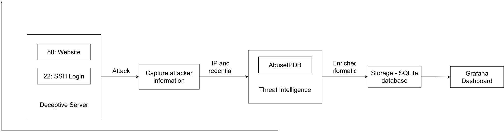

# Honeypot with Automated Threat Intelligence

This system captures malicious login attempts and unauthorized HTTP requests via ports 22 and 80. It queries threat intelligence APIs to score the IP address, logs and ingest into the database. The data is visualized on a real-time dashboard.

## Architecture

## Deployment

Install requirements

    pip install -r requirements.txt

Initialize database

    python database.py

Run the server

    python server.py
